# Validata Database Schema

Validata is an EDC (electronic data capture) system for clinical research. This schema reflects
that domain directly — soft deletes instead of hard ones, immutable measurement records, and an
append-only audit log baked into the database itself.

```mermaid
erDiagram
    STUDIES ||--o{ PARTICIPANTS : "has"
    STUDIES ||--o{ MEASUREMENTS : "has"
    STUDIES ||--o{ STUDY_MEMBERS : "has"
    STUDIES ||--o{ QUERIES : "has"
    STUDIES ||--o{ SIGNATURES : "has"
    STUDIES ||--o{ CONSENT_FORM_VERSIONS : "has"
    STUDIES ||--o{ CONSENT_RECORDS : "has"
    STUDIES ||--o{ ADVERSE_EVENTS : "has"
    STUDIES ||--o{ DELEGATIONS : "has"
    STUDIES ||--o{ PARTICIPANT_ID_COUNTERS : "has"
    STUDIES ||--o{ AUDIT_LOG : "logs"

    PARTICIPANTS ||--o{ MEASUREMENTS : "has"
    PARTICIPANTS ||--o{ CONSENT_RECORDS : "has"
    PARTICIPANTS ||--o{ ADVERSE_EVENTS : "has"

    CONSENT_FORM_VERSIONS ||--o{ CONSENT_RECORDS : "versions"
    ORGANISATIONS ||--o{ PROFILES : "employs"

    PROFILES {
        UUID id PK,FK "-> auth.users"
        TEXT email
        TEXT role "applicant, admin, mentor, investigator, site_coordinator, data_manager, monitor, auditor, irb_reviewer, team_member"
        TEXT status "wait_email_confirm, wait_approval, active, suspended, deleted - composite CHECK ties wait_* to role=applicant only"
        TIMESTAMPTZ candidate_expires_at "applicant-only expiry; reset when wait_email_confirm -> wait_approval"
        TEXT change_reason
        UUID organisation_id FK
        TIMESTAMPTZ created_at
        TIMESTAMPTZ deleted_at "audit timestamp only - status='deleted' is authoritative, not this column"
    }

    STUDIES {
        UUID id PK
        TEXT name UK
        INTEGER recruitment_goal
        UUID created_by FK
        TIMESTAMPTZ deleted_at
        UUID deleted_by FK
        BOOLEAN retention_hold
        TEXT lock_state "open, locked"
        TIMESTAMPTZ locked_at
        UUID locked_by FK
        TEXT lock_reason
        TEXT activation_status "pending, active, suspended, closed"
        TIMESTAMPTZ created_at
    }

    PARTICIPANTS {
        TEXT id PK "composite with study_id, e.g. P-1001"
        UUID study_id PK,FK
        DATE enrollment_date
        TEXT health_status "Healthy, Ankle Injured"
        TEXT status "Active, Completed, Dropped"
        TEXT status_reason
        UUID created_by FK
        INTEGER age
        TEXT gender
    }

    MEASUREMENTS {
        BIGINT id PK
        TEXT participant_id FK "composite -> participants(id, study_id)"
        UUID study_id FK
        NUMERIC goniometer
        NUMERIC ai_model
        DATE test_date
        BOOLEAN is_valid
        TEXT validity_reason
        UUID created_by FK
        TEXT capture_method "manual_entry, file_import"
        TEXT notes
        TIMESTAMPTZ timestamp
    }

    AUDIT_LOG {
        BIGSERIAL id PK
        TIMESTAMPTZ occurred_at
        UUID actor_id FK
        TEXT actor_email
        TEXT table_name
        TEXT record_id
        TEXT action "INSERT, UPDATE, DELETE, ROLE_CHANGE, STATUS_CHANGE, LOCK, UNLOCK, SIGN_OFF, SOFT_DELETE, DESTRUCTION_REQUEST"
        JSONB old_value
        JSONB new_value
        TEXT reason
        UUID study_id FK
    }

    QUERIES {
        BIGSERIAL id PK
        UUID study_id FK
        TEXT record_table "measurements or participants"
        TEXT record_id
        TEXT field_name
        TEXT severity "minor, major, critical"
        TEXT status "open, answered, resolved, closed"
        UUID raised_by FK
        TIMESTAMPTZ raised_at
        TEXT query_text
        UUID answered_by FK
        TIMESTAMPTZ answered_at
        TEXT answer_text
        UUID resolved_by FK
        TIMESTAMPTZ resolved_at
        UUID closed_by FK
        TIMESTAMPTZ closed_at
    }

    SIGNATURES {
        BIGSERIAL id PK
        UUID study_id FK
        UUID signer_id FK
        TEXT signer_email
        TEXT record_type
        TEXT record_id
        TEXT milestone
        TEXT meaning
        TIMESTAMPTZ signed_at
    }

    CONSENT_FORM_VERSIONS {
        BIGSERIAL id PK
        UUID study_id FK
        TEXT version UK "unique with study_id"
        TIMESTAMPTZ irb_approved_at
        TIMESTAMPTZ activated_at
        TEXT content_hash
        UUID created_by FK
        TIMESTAMPTZ created_at
    }

    CONSENT_RECORDS {
        BIGSERIAL id PK
        TEXT participant_id FK "composite -> participants(id, study_id)"
        UUID study_id FK
        BIGINT form_version_id FK
        TIMESTAMPTZ consented_at
        TEXT method "written, electronic, verbal_with_witness"
        BOOLEAN copy_delivered
        UUID witnessed_by FK
        UUID recorded_by FK
        TEXT notes
    }

    ADVERSE_EVENTS {
        BIGSERIAL id PK
        UUID study_id FK
        TEXT participant_id FK "composite -> participants(id, study_id)"
        TEXT ae_type "ae = adverse event, sae = serious AE, susar = suspected unexpected serious adverse reaction"
        TEXT description
        TEXT severity "mild, moderate, severe, life_threatening, fatal"
        TEXT causality "unrelated, unlikely, possible, probable, definite"
        TEXT expectedness "expected, unexpected"
        DATE onset_date
        DATE report_date
        DATE resolution_date
        TEXT outcome
        DATE authority_deadline
        TIMESTAMPTZ authority_submitted_at
        UUID reported_by FK
        TIMESTAMPTZ created_at
        TEXT notes
    }

    DELEGATIONS {
        BIGSERIAL id PK
        UUID study_id FK
        UUID delegated_to FK
        TEXT task_description
        UUID delegated_by FK
        DATE effective_from
        DATE effective_to
        TIMESTAMPTZ revoked_at
        UUID revoked_by FK
        TIMESTAMPTZ created_at
    }

    ORGANISATIONS {
        UUID id PK
        TEXT name UK
        TEXT type "sponsor, cro, site, irb"
        TIMESTAMPTZ created_at
    }

    STUDY_MEMBERS {
        UUID study_id PK,FK
        UUID user_id PK,FK
        TEXT study_role "snapshot at grant time - not live role"
        UUID granted_by FK
        TIMESTAMPTZ granted_at
    }

    PARTICIPANT_ID_COUNTERS {
        UUID study_id PK,FK
        INTEGER last_id "atomic counter; seeded at 1000, incremented before use, so the first participant issued is P-1001"
    }

    SIGNING_TOKENS {
        TEXT token PK
        UUID user_id FK
        TEXT purpose
        TIMESTAMPTZ created_at
        TIMESTAMPTZ expires_at
        TIMESTAMPTZ consumed_at
    }
```

## Notes

- **`auth.users`** (Supabase-managed, not shown above) is referenced by nearly every table via
  `created_by` / `actor_id` / `signer_id` / etc. — omitted here to keep the diagram readable.
- **Composite keys**: `participants` uses `(id, study_id)` as its primary key (not just `id`), since
  the human-readable id (e.g. `P-1001`) is only unique within a study. Every table that references
  a participant does so via that composite FK.
- **Immutability**: `measurements` and `participants` have `BEFORE UPDATE` triggers restricting
  which columns can change after insert — not representable in an ER diagram, so spelled out here:
  - `measurements` (`enforce_measurements_immutability`) — only `is_valid` and `validity_reason`
    may change. `participant_id`, `study_id`, `goniometer`, `ai_model`, `notes`, `timestamp`,
    `test_date`, `created_by`, and `capture_method` are frozen after insert.
  - `participants` (`enforce_participants_immutability`) — only `status` and `status_reason` may
    change. `study_id`, `age`, `gender`, `health_status`, `enrollment_date`, and `created_by`
    are frozen after insert.
- **`audit_log`** is append-only (no UPDATE/DELETE policy) and is written to by a trigger
  (`log_audit_event`) attached to nearly every table above.
- `SIGNING_TOKENS` has no FK relationship drawn to other domain tables — it only relates to
  `auth.users` via `user_id`.
- **`ORGANISATIONS`** is schema + RLS groundwork only (see `FEATURES.md`) — no API routes, Server
  Actions, or dashboard pages exist for it yet. `profiles.organisation_id` is a nullable FK into it.
