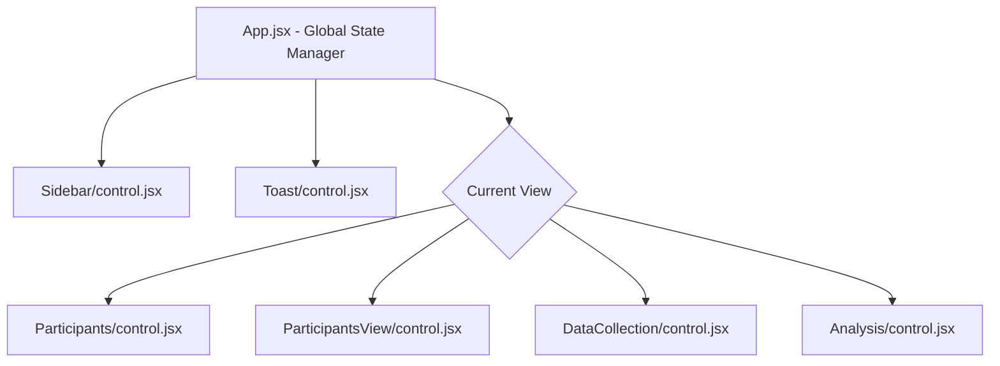

# React Prototype Architecture Walkthrough

This document explains the architecture of the Validata React prototype. The application follows a modular, three-tier architecture (Display-Service-Control) for each component, ensuring clean separation of concerns.

## Component Hierarchy

## Three-File Component Architecture
Each component in the `src/components/` directory is organized into its own folder containing exactly three files:

### 1. `control.jsx` (The Container)
This file acts as the entry point for the component. It is responsible for:
- Managing local React state (like form inputs or toggle flags).
- Handling user interactions (e.g., `onSubmit`, `onClick`).
- Calling logic from `service.js`.
- Passing data and callbacks down to `display.jsx`.

### 2. `display.jsx` (The View)
This is a purely presentational (dumb) component. It receives data and callbacks as props from `control.jsx`. It contains only JSX and Tailwind CSS classes. It has no complex business logic and does not manage state.

### 3. `service.js` (The Model / Logic)
This file contains business logic completely separated from React. It is responsible for:
- Formatting and processing data.
- Sorting arrays (e.g., parsing timestamps for the Data View).
- Preparing configuration objects for third-party libraries like Chart.js.

## Component Breakdown

### App.jsx (Global State)
The `App` component acts as the main orchestrator for the application. It holds the global state:
- `currentView`: Manages simple state-based routing (`participants`, `data`, `analysis`).
- `participants`: Array of active and dropped participants loaded from `mockData.json`.
- `measurements`: Array of measurement logs loaded from `mockData.json`.
- `toastMessage` / `showToast`: Controls the global notification system.
Data flows unidirectionally from `App.jsx` down to the specific `control.jsx` files.

### Sidebar
- **Control**: Sets up navigation functions and reads items from the service.
- **Service**: Maintains the static list of navigation items and their Lucide icons.
- **Display**: Renders the dark sidebar UI.

### Participants
- **Control**: Manages the local `consent` checkbox state and handles the form submission to register new participants.
- **Service**: Helper logic for participants (e.g., counting active participants).
- **Display**: Renders the registration form and the Tracking Table.

### ParticipantsView
- **Control**: Manages local search (`searchTerm`) and health status filtering states.
- **Service**: Calculates clinical and demographic stats (average age, healthy/sick count).
- **Display**: Renders a premium demographic metrics dashboard, interactive filters, and the detailed participant directory table.

### DataCollection
- **Control**: Manages the form inputs (`participantId`, `notes`) and the `uploadedFile` state.
- **Service**: Filters the global participant list to return only `Active` participants.
- **Display**: Renders the Measurement Log form and the drag-and-drop file upload UI.

### Analysis
- **Control**: Manages the simulated AI loading state (`isAnalyzing`) and handles triggering the report generation.
- **Service**: Contains critical logic including:
  - `sortMeasurementsDescending()`: Parses string dates and sorts measurements so the newest are always at the top.
  - `getProgressChartData()`: Calculates the Measured vs Pending chart.
  - `getStatusChartData()`: Calculates the Active vs Dropped chart.
- **Display**: Renders the Chart.js canvasses, the AI analysis result box, and the Research Data View table.

### Toast
- **Control**: Uses a `useEffect` hook to automatically hide the toast after a certain duration.
- **Service**: Exports the `TOAST_DURATION` constant.
- **Display**: Renders the absolute-positioned alert box.

## Data Management
Mock data is stored in `src/mockData.json` and loaded into the `App` state upon initialization. Any changes made in the UI update the React state in memory. Because this is a prototype, refreshing the page will reset the data to its initial state.
